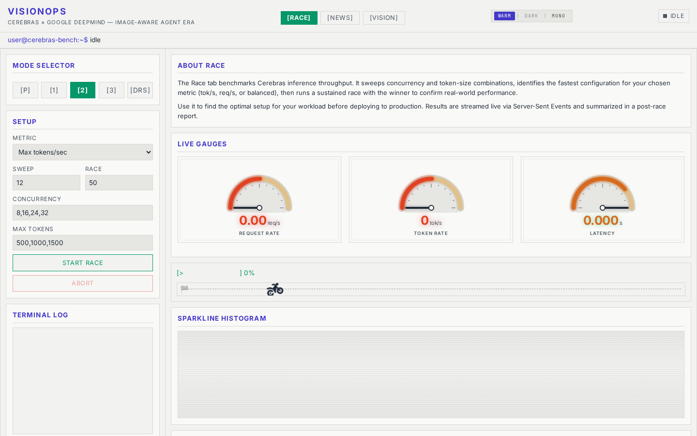

<div align="center">

# cfire

**Production Cerebras SDK + F1-styled benchmarking dashboard.**

<p align="center">
  
</p>

[](https://www.python.org/downloads/)
[](LICENSE)
[](#tests)
[](#tests)
[](https://www.deepmind.com/models/gemma)
[](https://www.cerebras.ai/)

</div>

---

## What this is

- **`cfire`** — a production-grade Python SDK over Cerebras Inference: typed retry/circuit-breaker/rate-limiter, real SSE streaming, tiered cache, multi-backend router, prefix-cache-aware `AgentSession`.
- **F1 Race dashboard** — a FastAPI + vanilla-JS SPA that fires ~50 concurrent requests across 5 concurrency × token configs (P / 1 / 2 / 3 / DRS) and scores them on tok/s, req/s, and balanced sustainability. Live, in your browser.
- **VisionOps** — an image-aware SRE agent on Gemma 4 31B: drop a screenshot of a failing dashboard, get a typed diagnosis with severity-tagged actions.

## Why this is specifically Cerebras

Three features in this repo are only meaningful on Cerebras-class inference. Each is verifiable in the source.

- **`prompt_cache_key` pins KV across turns.** `AgentSession` hashes `(system_prompt, tool_defs)` to a deterministic key so the server keeps the prefix hot — turns 2+ skip prefill. ([`cfire/agent.py:49-102`](cfire/agent.py), [`cfire/models.py:73`](cfire/models.py))
- **Rate-limit-aware concurrency.** A dual limiter tracks `req/min` + `tok/min` via `asyncio.Condition`, so the sweep saturates the ceiling without tripping the 6-fail circuit breaker. ([`cfire/reliability.py:159`](cfire/reliability.py), [`cfire/reliability.py:40`](cfire/reliability.py))
- **Live headroom telemetry.** `headroom.py` tails the Cerebras log, parses `x-ratelimit-*` headers, and broadcasts snapshots to the dashboard — you see exactly when you're about to throttle. ([`headroom.py:300`](headroom.py))

## Quick start

```bash
# 1. Clone
git clone https://github.com/DesignerEE/Cerebras-Gemma4.git
cd Cerebras-Gemma4

# 2. Install (Python 3.11+)
python -m venv .venv && source .venv/bin/activate
pip install -e ".[dev]"

# 3. Add your Cerebras key (get one at https://inference.cerebras.ai/)
export CEREBRAS_API_KEY=csk-...

# 4. Launch the dashboard
python web_demo.py
# → http://localhost:8000
```

Tabs: **RACE** (sweep + sustained benchmark), **NEWS** (multi-agent scout → commander pipeline), **VISION** (multimodal SRE diagnosis).

---

## Table of contents

1. [The F1 Race](#the-f1-race)
2. [Architecture](#architecture)
3. [`cfire` SDK](#cfire-sdk)
4. [AgentSession — prefix-cache-aware multi-turn](#agentsession--prefix-cache-aware-multi-turn)
5. [VisionOps — image-aware SRE agent](#visionops--image-aware-sre-agent)
6. [Dashboard API](#dashboard-api)
7. [Benchmarks](#benchmarks)
8. [Tests](#tests)
9. [Project structure](#project-structure)
10. [Roadmap & status](#roadmap--status)
11. [License](#license)
12. [Acknowledgements](#acknowledgements)

---

## The F1 Race

The "race" is a self-benchmark sweep. Five configs — labelled after F1 gears — fire concurrent requests against Cerebras Inference, and the dashboard scores them live on three axes: raw tok/s, req/s, and balanced sustainability.

| Gear | Concurrency | Max tokens | Use case |
|------|-------------|------------|----------|
| **P** Pit  | 0  | 0    | Stop the car |
| **1** Eco  | 8  | 250  | Low-latency probe |
| **2** Race | 16 | 1000 | Balanced sustained race |
| **3** Qualy | 24 | 1500 | Max tok/s qualifying lap |
| **DRS** Boost | 32 | 1000 | Push limits (may queue) |

Presets live in a single JS object at [`static/index.html:1660-1666`](static/index.html). The sweep runs all five in sequence, then transitions to a sustained phase at the winning config for ~20 seconds.

## Architecture

```
                 ┌────────────────────────────────────────────┐
                 │              Browser (SPA)                 │
                 │   static/index.html — vanilla JS, no build │
                 │   EventSource SSE × 4 streams              │
                 └──────────────────┬─────────────────────────┘
                                    │  fetch() + SSE
                                    ▼
                 ┌────────────────────────────────────────────┐
                 │       web_demo.py  (FastAPI + uvicorn)     │
                 │       18 endpoints • 4 SSE channels        │
                 │       RaceManager · NewsManager            │
                 └──┬──────────┬──────────┬──────────┬────────┘
                    │          │          │          │
              ┌─────▼───┐ ┌────▼────┐ ┌───▼────┐ ┌───▼────────────┐
              │ RACE    │ │ NEWS    │ │ VISION │ │ HEADROOM/MEMORY│
              │ sweep + │ │ scouts →│ │ Gemma  │ │ rate-limit +   │
              │ sustain │ │ command │ │ 4 31B  │ │ cross-run best │
              └────┬────┘ └────┬────┘ └───┬────┘ └───┬────────────┘
                   │           │          │          │
                   └───────────┴──────────┴──────────┘
                               │
                               ▼
                 ┌────────────────────────────────────────────┐
                 │              cfire (this repo)              │
                 │  OpenAI-compatible client for Cerebras      │
                 │  retry · circuit · rate-limit · SSE stream  │
                 │  tiered cache (LRU + Redis) · smart router  │
                 └────────────────────────────────────────────┘
                               │
                               ▼
                      Cerebras Inference API
                      gemma-4-31b on WSE-3
```

Browser subscribes to four SSE channels (race / news / headroom / diffusiongemma). The FastAPI layer orchestrates three concurrent managers. Every call routes through `cfire`, which owns retry, circuit-breaking, rate-limiting, caching, and streaming.

## `cfire` SDK

The SDK extracted from this dashboard — usable on its own. 46 public symbols ([`cfire/__init__.py:69-96`](cfire/__init__.py)), grouped by concern:

| Group | What it gives you |
|-------|-------------------|
| **Client** | `AsyncCfire`, `Cfire` — sync + async OpenAI-compatible clients |
| **Models** | `ChatRequest`, `ChatResponse`, `Message`, `StreamChunk`, `Usage`, `TimeInfo`, `Choice`, `ResponseFormat`, `PredictedOutput` |
| **Agent** | `AgentSession` — prefix-cache-aware multi-turn (see below) |
| **Reliability** | `RetryPolicy`, `CircuitBreaker` (opens at 6 fails, 30 s cooldown), `DualRateLimiter` (req/min + tok/min) |
| **Cache** | `MemoryLRU` (bounded, TTL), `RedisCache` (zero-field-loss JSON), `TieredCache` (L1 + L2) |
| **Transport** | `Transport`, `maybe_compress`, `parse_ratelimit_headers`, `parse_time_info` |
| **Streaming** | `parse_sse_stream`, `parse_chunk_obj` — real SSE, not yield-the-whole-text |
| **Backends** | `Backend`, `CerebrasBackend`, `DiffusionGemmaBackend`, `MockBackend` |
| **Errors** | `CerebrasError` tree: `RetryableError` (`RateLimitError`, `ServerError`, `RequestTimeoutError`) vs `NonRetryableError` (`AuthError`, `BadRequestError`, `CircuitOpenError`) |

```python
import asyncio
from cfire import AsyncCfire, ChatRequest

async def main():
    async with AsyncCfire() as client:
        r = await client.complete(ChatRequest(
            model="gemma-4-31b",
            messages=[{"role": "user", "content": "Hello, Cerebras."}],
        ))
        print(r.choices[0].message.content)
        print(r.time_info)  # queue_time / prompt_time / completion_time / total_time

asyncio.run(main())
```

Per-response `time_info` telemetry, adaptive concurrency driven by `x-ratelimit-*` headers, `predicted_output` for regeneration-heavy workloads, `service_tier` for queue priority, `reasoning_effort` for reasoning models — all on `ChatRequest`.

## AgentSession — prefix-cache-aware multi-turn

`AgentSession` pins `(system_prompt, tool_defs)` as a stable prefix, hashes it to a deterministic SHA-256, and sets `prompt_cache_key` on every request so Cerebras keeps the KV cache hot across turns. Same prefix → same key; different prefix → different key; tool order matters (KV layout depends on serialization order).

```python
import asyncio
from cfire import AgentSession

async def main():
    async with AgentSession(
        system="You are a senior SRE.",
        tools=[{"type": "function", "function": {...}}],
    ) as s:
        r1 = await s.chat("Read the alert")
        r2 = await s.chat("What changed in the last hour?")  # prefix cached → faster
        print(s.prompt_cache_key)  # "agent-" + sha256[:16]

asyncio.run(main())
```

Source: [`cfire/agent.py:49-102`](cfire/agent.py). The hash function is tested for determinism, tool-order sensitivity, and `None` handling ([`cfire/tests/test_agent_prefix_key.py`](cfire/tests/test_agent_prefix_key.py)).

## VisionOps — image-aware SRE agent

Drop a screenshot of a failing dashboard, terminal, or piece of hardware; get back a typed `Diagnosis` with severity (`info` / `warning` / `critical`) and a list of `Action` objects (`name`, `command`, `safe_to_run`).

```python
import asyncio
from vision_ops import VisionOpsAgent

async def main():
    with open("screenshot.png", "rb") as f:
        image_bytes = f.read()
    agent = VisionOpsAgent()  # defaults to gemma-4-31b
    d = await agent.analyze(image_bytes, mime_type="image/png")
    print(d.severity)
    for a in d.actions:
        print(a.name, "|", a.command, "| safe:", a.safe_to_run)

asyncio.run(main())
```

The parser is robust to whatever Gemma 4 emits — fenced JSON, XML-tagged JSON, delimited blocks, or free text — and degrades gracefully to a severity-keyword salvage path. Source: [`vision_ops/agent.py:76`](vision_ops/agent.py) (440 LoC, 2-file package).

## Dashboard API

`web_demo.py` ([815 lines](web_demo.py)) exposes **18 HTTP endpoints** (11 GET + 7 POST) across 6 functional groups, including **4 SSE channels**.

### RACE (7 endpoints)
| Method | Path | Purpose |
|-------|------|---------|
| `GET`  | `/` | Dashboard HTML |
| `POST` | `/api/start` | Start sweep + sustained race |
| `POST` | `/api/stop` | Abort current race |
| `GET`  | `/api/status` | Server status |
| `GET`  | `/api/race/report` | Fetch race report |
| `POST` | `/api/race/report/llm` | LLM analysis of report |
| `GET`  | [`/api/stream`](web_demo.py:553) | **SSE** — live race telemetry |

### NEWS (3 endpoints)
| Method | Path | Purpose |
|-------|------|---------|
| `POST` | `/api/news/start` | Spawn scouts + commander |
| `POST` | `/api/news/stop` | Stop news agents |
| `GET`  | [`/api/news/stream`](web_demo.py:593) | **SSE** — scout progress + report |

### HEADROOM (2 endpoints)
| Method | Path | Purpose |
|-------|------|---------|
| `GET`  | `/api/headroom/status` | Rate-limit headroom snapshot |
| `GET`  | [`/api/headroom/stream`](web_demo.py:619) | **SSE** — headroom live |

### BENCHMARK MEMORY (4 endpoints)
| Method | Path | Purpose |
|-------|------|---------|
| `GET`  | `/api/benchmark/memory/insights` | Aggregate historical insights |
| `GET`  | `/api/benchmark/memory/search` | Search prior runs |
| `GET`  | `/api/benchmark/memory/compare` | Compare configs |
| `POST` | `/api/benchmark/memory/test` | One-off benchmark test |

### DIFFUSION (1 endpoint)
| Method | Path | Purpose |
|-------|------|---------|
| `GET`  | [`/api/diffusiongemma/stream_test`](web_demo.py:678) | **SSE** — DiffusionGemma4 test stream |

### VISION (1 endpoint)
| Method | Path | Purpose |
|-------|------|---------|
| `POST` | [`/api/vision/analyze`](web_demo.py:772) | Multimodal image diagnosis |

## Benchmarks

The dashboard **is** the benchmark — every number is reproducible from a fresh `python web_demo.py` run. A peak tok/s figure quoted in a README would be meaningless: it depends on your Cerebras tier, model, time of day, and sweep config. Open the RACE tab, press START, watch the gauge.

What the sweep measures, concretely:

- **Per-config tok/s** — completion tokens / wall-clock completion time, averaged across all concurrent requests in that config.
- **Per-config req/s** — completed requests / sweep duration.
- **Sustained-phase behavior** — after the sweep, the winning config runs for ~20 s to expose throttling, circuit-breaker trips, and queueing.
- **Headroom** — live `x-ratelimit-*` consumption — watch the ceiling approach in real time.

For full tuning guidance (when to use Eco vs Qualy, how to read circuit-breaker trips, how to read the headroom sparkline), see [`CEREBRAS_SPEED_GUIDE.md`](CEREBRAS_SPEED_GUIDE.md) and [`HEADROOM.md`](HEADROOM.md).

## Tests

```bash
# Main suite — cfire + vision_ops + news pipeline
pytest cfire/tests tests/ -q --cov=cfire --cov-report=term-missing
```

**150 passed, 1 xfailed** (~89 % coverage on `cfire/`). The single xfail is a Phase-3 router placeholder. Async tests run on `asyncio_mode = auto` — no `@pytest.mark.asyncio` boilerplate.

Notable coverage: `AgentSession` lifecycle + tool-order sensitivity ([`cfire/tests/test_agent.py`](cfire/tests/test_agent.py), [`cfire/tests/test_agent_prefix_key.py`](cfire/tests/test_agent_prefix_key.py)), real SSE parsing ([`cfire/tests/test_streaming.py`](cfire/tests/test_streaming.py)), tiered-cache serialization round-trip, retry-policy exception classification, dual-rate-limiter concurrency.

## Project structure

```
.
├── cfire/                       # core SDK — 16 modules, 46 public symbols
│   ├── __init__.py              # public surface
│   ├── agent.py                 # AgentSession (prefix-cache-aware)
│   ├── client.py                # AsyncCfire + Cfire
│   ├── models.py                # ChatRequest/Response, prompt_cache_key, etc.
│   ├── reliability.py           # RetryPolicy + CircuitBreaker + DualRateLimiter
│   ├── cache.py                 # MemoryLRU + RedisCache + TieredCache
│   ├── streaming.py             # real SSE parser
│   ├── transport.py             # HTTP transport + rate-limit parsing
│   ├── backends.py              # CerebrasBackend + DiffusionGemmaBackend
│   └── tests/                   # 150-unit suite
├── vision_ops/                  # image-aware SRE agent (440 LoC, 2 files)
├── web_demo.py                  # FastAPI dashboard (815 lines, 18 endpoints, 4 SSE)
├── static/index.html            # vanilla-JS SPA frontend (2415 lines)
├── news_agents.py               # commander-scout news pipeline (349 lines)
├── headroom.py                  # rate-limit headroom monitor (370 lines)
├── benchmark_memory.py          # historical race indexing (227 lines)
├── cerebras_race_client.py      # legacy shim — Phase 4 migration target
├── cerebras_smoke_test.py       # quick API connectivity check
├── cerebras_race_optimizer.py   # race-tuning helpers
├── build_demo_video.py          # ffmpeg assembler for 60 s hackathon demo
├── pyproject.toml               # package metadata
├── pytest.ini                   # asyncio_mode=auto
└── LICENSE                      # MIT
```

## Roadmap & status

**Alpha — actively polishing for hackathon submission.**

Done:
- ✅ `cfire` SDK: client, models, reliability, cache, transport, streaming, agent session
- ✅ F1 RACE dashboard with sweep + sustain + LLM report
- ✅ VisionOps multimodal SRE diagnosis (Gemma 4 31B)
- ✅ News multi-agent scout → commander pipeline
- ✅ Headroom + benchmark-memory panels
- ✅ 150 tests passing, ~89 % coverage, 0 embedded secrets

In progress / pending (tracked in [`tasks/todo.md`](tasks/todo.md)):
- 🔄 Migrate `web_demo.py` + `news_agents.py` off the `cerebras_race_client.py` legacy shim onto native `cfire.AsyncCfire`, then delete the shim
- 🔄 Delete the `cfire-diffusion/` experimental fork (separate variant, kept temporarily)
- 🔄 Add CI workflow (`.github/workflows/test.yml`), `.env.example`, favicon
- 🔄 Fix `pyproject.toml` author metadata + `project.urls` (currently points to a placeholder repo)
- 🔄 Decompose `web_demo.py:RaceManager` (currently a god-object)

## License

[MIT](LICENSE) © 2026 DesignerEE.

## Acknowledgements

- [Cerebras Inference](https://www.cerebras.ai/) — the WSE-3 hardware + inference API this project is built on
- [FastAPI](https://fastapi.tiangolo.com/) + [uvicorn](https://www.uvicorn.org/) — the dashboard server
- [Pydantic](https://docs.pydantic.dev/) — typed models up and down the stack
- [httpx](https://www.python-httpx.org/) — HTTP client with first-class async + HTTP/2
- [Gemma 4 31B](https://www.deepmind.com/models/gemma) — the vision/SRE reasoning model
